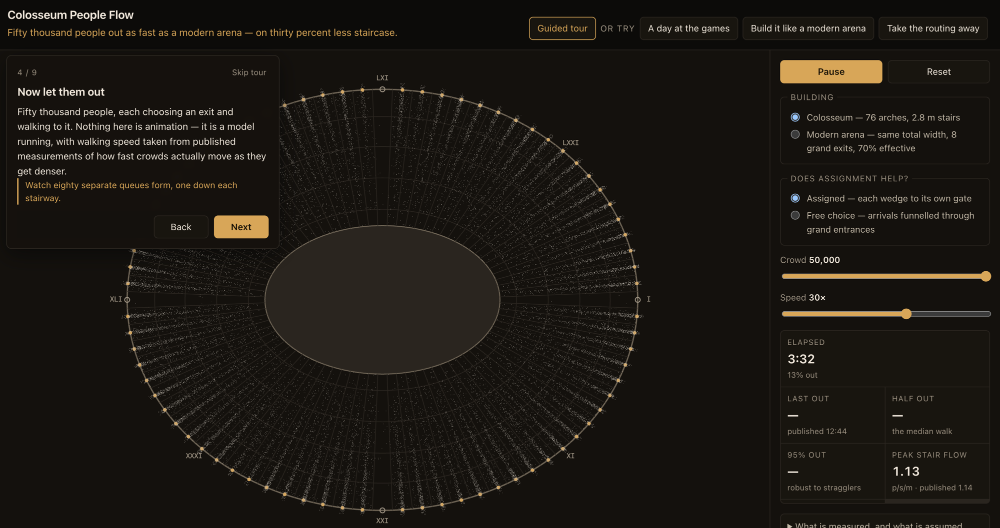

# Colosseum People Flow

**Fifty thousand people out as fast as a modern arena — on about thirty percent less staircase.**

An interactive model of how the Flavian Amphitheatre emptied, and why a building with less egress width than a modern code would permit still clears in a comparable time.

🔗 **[Open the live tool](https://dtm988.github.io/colosseum_people_flow/)** — it opens on a nine-step guided tour.



*Three and a half minutes in. Eighty queues, one per wedge, none of them meeting — which is the whole reason the building works. Note the readout on the right: the model's peak stair flow is 1.13 person/s/m against a published 1.14 it never sees.*

## What you are looking at

A plan of the amphitheatre with 50,000 individually simulated spectators leaving it. Press through the tour, or drive it yourself:

- **Building** — the Colosseum's 76 numbered arches, or a modern arena with the same total exit width gathered into 8 grand exits
- **Does assignment help?** — spectators using the arch their seat assigned them, or choosing freely
- **Crowd** and **Speed**

Click any wedge for who sat there and how far they had to walk. Open *What is measured, and what is assumed* for every figure in the tool with its evidence.

## The three findings

1. **The Colosseum runs on about 4.3 mm of working stair per spectator.** A modern building code asks for 7.6 mm. It would fail a contemporary egress code and clears the building anyway.
2. **It gets away with that because no two routes share a corridor.** Every wedge has its own stair and its own arch, so nothing merges inside the building and each metre of stair runs near its theoretical maximum. The model's peak specific flow, **1.13 person/s/m**, is an output — and it lands within 1% of the 1.14 measured in a published study the model never sees.
3. **Assignment does not make it faster. It makes it predictable.** Let people choose freely and the median spectator gets out *sooner*; only the last few percent take longer. The assignment buys the tail, not the median.

## Running it locally

No toolchain, no install, no build step. ES modules must be served over HTTP rather than opened from disk:

```
python3 -m http.server 8000
```

then open <http://localhost:8000>.

## Checking the model

```
node validate.js
```

Runs the simulation headless and prints what it produces next to the published figures — it is allowed to disagree with them, and does. It hard-fails on the invariants: agent conservation, a monotone clearance curve, no NaN, determinism from the seed, and that the build version agrees across every file.

```
Clearance
  mode        t50        t95        t100      busiest/mean   peak flow
  routed      5m 47s     8m 20s     9m 12s    1.11           1.13 p/s/m
  unrouted    4m 56s     7m 39s     10m 49s   1.38           1.13 p/s/m

Against the literature
  published last-person-out   12m 44s   (Fire (MDPI) 2022)
  this model, routed          9m 12s    (-212s)
  published specific flow     1.14 p/s/m  (on stairs)
  this model, peak on stairs  1.13 p/s/m
  the famous claim            15 min  [unsourced]
```

## Model, not reconstruction

Every figure the tool displays carries an evidence tier, enforced structurally — `src/claims.js` is the only route a number takes to the screen, and it throws on an unregistered key.

- **attested** — dimensions, the 80 arches and 76 public ones, the carved numerals, the seating hierarchy, the speed-density relationship (~35,000 observations), the 71% familiar-exit bias
- **inferred** — capacity (estimates run 50,000–87,000), stair widths, published specific flows
- **contested** — the numbered ticket tokens; the argument here rests on the architecture instead
- **unsourced** — "empties in fifteen minutes", which has no traceable origin at all
- **modeled** — the 8-exit comparison building, which is a thought experiment and says so

What is **emergent** rather than imposed: where queues form, how they interact, the specific flow the building achieves, and how clearance responds to exit policy and capacity. What is **imported** from measurement: how fast people walk at a given density, how much flow a metre of stair carries, and the familiar-exit bias. Saying which is which is the point — see [DESIGN.md](DESIGN.md).

## Layout

```
index.html            the tool
styles.css
src/claims.js         every displayed figure, with its evidence tier
src/geometry.js       ellipse, wedges, tiers, heights      (pure)
src/rng.js            seeded PRNG                          (pure)
src/crowd.js          the simulation                       (pure, DOM-free)
src/render.js         plan view
src/chart.js          clearance curve and gate strip
src/tour.js           the nine-step explainer
src/ui.js             wiring
validate.js           headless model check — what CI runs
```

Nothing above `render.js` imports anything DOM, which is how the same modules run in the browser and in Node.

Zero runtime dependencies. Node is used only for `validate.js`.

## Licence

MIT — see [LICENSE](LICENSE).
